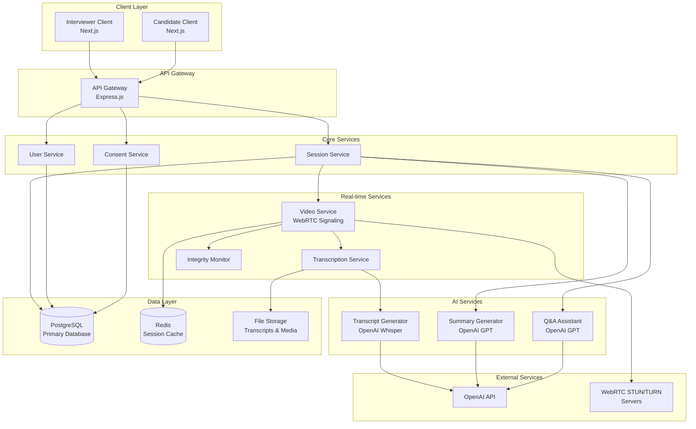
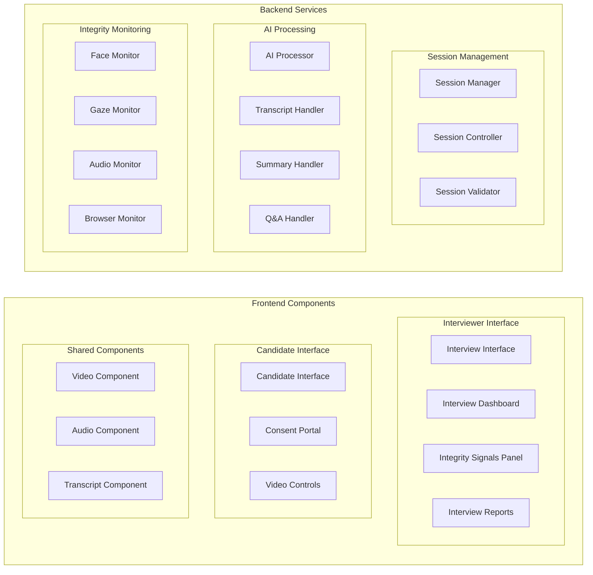

# Design Document: AI-Powered Interview & Proctoring Platform

## Overview

The AI-Powered Interview & Proctoring Platform is a comprehensive web-based solution that combines real-time video interviewing with AI-powered assistance and integrity monitoring. The system is built on a modern technology stack using Next.js for the frontend, Node.js for the backend, PostgreSQL for data persistence, WebRTC for video communications, and OpenAI for AI capabilities.

The platform operates on the principle of advisory monitoring, where AI-generated integrity signals provide supplementary information to interviewers without automatically disqualifying candidates. This approach maintains the human element in decision-making while leveraging AI to enhance the interview process through transcription, summarization, and contextual analysis.

## Architecture

The system follows a microservices-inspired architecture with clear separation of concerns across different functional domains. The architecture prioritizes real-time performance, scalability, and security while maintaining ethical AI practices.



### Component Architecture



## Components and Interfaces

### Core Service Interfaces

#### Session Service Interface

```typescript
interface SessionService {
  createSession(params: SessionCreateParams): Promise<Session>;
  joinSession(sessionId: string, userId: string, role: UserRole): Promise<SessionJoinResult>;
  endSession(sessionId: string, userId: string): Promise<SessionEndResult>;
  getSessionStatus(sessionId: string): Promise<SessionStatus>;
  updateSessionSettings(sessionId: string, settings: SessionSettings): Promise<void>;
}

interface SessionCreateParams {
  interviewerId: string;
  candidateEmail: string;
  scheduledTime: Date;
  duration: number; // minutes
  title: string;
  description?: string;
}

interface Session {
  id: string;
  interviewerId: string;
  candidateId?: string;
  status: SessionStatus;
  createdAt: Date;
  scheduledTime: Date;
  startedAt?: Date;
  endedAt?: Date;
  duration: number;
  settings: SessionSettings;
  integrityReport?: IntegrityReport;
}

interface SessionSettings {
  recordingEnabled: boolean;
  transcriptionEnabled: boolean;
  integrityMonitoringEnabled: boolean;
  allowCandidateRecording: boolean;
}

enum SessionStatus {
  SCHEDULED = 'scheduled',
  WAITING = 'waiting',
  ACTIVE = 'active',
  ENDED = 'ended',
  CANCELLED = 'cancelled'
}
```

#### Video Service Interface

```typescript
interface VideoService {
  initializeConnection(sessionId: string, userId: string): Promise<WebRTCConfig>;
  handleSignaling(sessionId: string, signal: SignalingMessage): Promise<void>;
  getConnectionStatus(sessionId: string, userId: string): Promise<ConnectionStatus>;
  updateMediaSettings(sessionId: string, userId: string, settings: MediaSettings): Promise<void>;
}

interface WebRTCConfig {
  iceServers: RTCIceServer[];
  sessionToken: string;
  signalingEndpoint: string;
}

interface SignalingMessage {
  type: 'offer' | 'answer' | 'ice-candidate' | 'media-settings';
  payload: any;
  from: string;
  to: string;
  timestamp: Date;
}

interface MediaSettings {
  videoEnabled: boolean;
  audioEnabled: boolean;
  videoQuality: 'low' | 'medium' | 'high';
  audioQuality: 'low' | 'medium' | 'high';
}
```

#### AI Service Interfaces

```typescript
interface TranscriptionService {
  startTranscription(sessionId: string, audioStream: MediaStream): Promise<void>;
  stopTranscription(sessionId: string): Promise<TranscriptResult>;
  getRealtimeTranscript(sessionId: string): Promise<TranscriptSegment[]>;
}

interface SummaryService {
  generateSummary(transcript: TranscriptResult): Promise<InterviewSummary>;
  getSummary(sessionId: string): Promise<InterviewSummary>;
}

interface QAService {
  askQuestion(sessionId: string, question: string): Promise<QAResponse>;
  getQuestionHistory(sessionId: string): Promise<QAInteraction[]>;
}

interface TranscriptResult {
  sessionId: string;
  segments: TranscriptSegment[];
  duration: number;
  confidence: number;
  language: string;
}

interface TranscriptSegment {
  id: string;
  speaker: 'interviewer' | 'candidate';
  text: string;
  startTime: number;
  endTime: number;
  confidence: number;
}

interface InterviewSummary {
  sessionId: string;
  overview: string;
  keyTopics: string[];
  candidateResponses: SummaryPoint[];
  interviewerQuestions: SummaryPoint[];
  recommendations: string[];
  generatedAt: Date;
}

interface SummaryPoint {
  topic: string;
  content: string;
  timestamp: number;
  importance: 'low' | 'medium' | 'high';
}

interface QAResponse {
  question: string;
  answer: string;
  confidence: number;
  sources: TranscriptReference[];
  timestamp: Date;
}

interface TranscriptReference {
  segmentId: string;
  text: string;
  timestamp: number;
  relevance: number;
}
```

#### Integrity Monitoring Interface

```typescript
interface IntegrityMonitor {
  startMonitoring(sessionId: string, candidateStream: MediaStream): Promise<void>;
  stopMonitoring(sessionId: string): Promise<IntegrityReport>;
  getRealtimeSignals(sessionId: string): Promise<IntegritySignal[]>;
  subscribeToSignals(sessionId: string, callback: (signal: IntegritySignal) => void): void;
}

interface IntegritySignal {
  id: string;
  sessionId: string;
  type: IntegritySignalType;
  severity: 'low' | 'medium' | 'high';
  description: string;
  timestamp: Date;
  duration?: number;
  metadata: Record<string, any>;
  resolved: boolean;
}

enum IntegritySignalType {
  FACE_NOT_PRESENT = 'face_not_present',
  MULTIPLE_FACES = 'multiple_faces',
  GAZE_DEVIATION = 'gaze_deviation',
  UNUSUAL_AUDIO = 'unusual_audio',
  TAB_SWITCH = 'tab_switch'
}

interface IntegrityReport {
  sessionId: string;
  signals: IntegritySignal[];
  summary: IntegrityReportSummary;
  generatedAt: Date;
}

interface IntegrityReportSummary {
  totalSignals: number;
  signalsByType: Record<IntegritySignalType, number>;
  totalDuration: number;
  signalDuration: number;
  signalPercentage: number;
  riskLevel: 'low' | 'medium' | 'high';
}
```

#### Consent Management Interface

```typescript
interface ConsentService {
  presentConsent(userId: string, sessionId: string): Promise<ConsentForm>;
  recordConsent(userId: string, sessionId: string, consent: ConsentResponse): Promise<ConsentRecord>;
  getConsentStatus(userId: string, sessionId: string): Promise<ConsentStatus>;
  revokeConsent(userId: string, sessionId: string): Promise<void>;
}

interface ConsentForm {
  id: string;
  version: string;
  sections: ConsentSection[];
  requiredConsents: string[];
}

interface ConsentSection {
  id: string;
  title: string;
  description: string;
  details: string[];
  required: boolean;
}

interface ConsentResponse {
  formId: string;
  consents: Record<string, boolean>;
  timestamp: Date;
  ipAddress: string;
  userAgent: string;
}

interface ConsentRecord {
  id: string;
  userId: string;
  sessionId: string;
  formId: string;
  consents: Record<string, boolean>;
  timestamp: Date;
  ipAddress: string;
  userAgent: string;
  revoked: boolean;
  revokedAt?: Date;
}

enum ConsentStatus {
  NOT_PRESENTED = 'not_presented',
  PENDING = 'pending',
  GRANTED = 'granted',
  DENIED = 'denied',
  REVOKED = 'revoked'
}
```

## Data Models

### Database Schema

The system uses PostgreSQL as the primary database with the following schema design:

```sql
-- Users table
CREATE TABLE users (
    id UUID PRIMARY KEY DEFAULT gen_random_uuid(),
    email VARCHAR(255) UNIQUE NOT NULL,
    name VARCHAR(255) NOT NULL,
    role VARCHAR(50) NOT NULL CHECK (role IN ('interviewer', 'candidate', 'admin')),
    created_at TIMESTAMP WITH TIME ZONE DEFAULT NOW(),
    updated_at TIMESTAMP WITH TIME ZONE DEFAULT NOW(),
    last_login TIMESTAMP WITH TIME ZONE,
    active BOOLEAN DEFAULT true
);

-- Sessions table
CREATE TABLE sessions (
    id UUID PRIMARY KEY DEFAULT gen_random_uuid(),
    interviewer_id UUID NOT NULL REFERENCES users(id),
    candidate_id UUID REFERENCES users(id),
    title VARCHAR(255) NOT NULL,
    description TEXT,
    status VARCHAR(50) NOT NULL DEFAULT 'scheduled' 
        CHECK (status IN ('scheduled', 'waiting', 'active', 'ended', 'cancelled')),
    scheduled_time TIMESTAMP WITH TIME ZONE NOT NULL,
    started_at TIMESTAMP WITH TIME ZONE,
    ended_at TIMESTAMP WITH TIME ZONE,
    duration_minutes INTEGER NOT NULL DEFAULT 60,
    settings JSONB NOT NULL DEFAULT '{}',
    created_at TIMESTAMP WITH TIME ZONE DEFAULT NOW(),
    updated_at TIMESTAMP WITH TIME ZONE DEFAULT NOW()
);

-- Session participants table
CREATE TABLE session_participants (
    id UUID PRIMARY KEY DEFAULT gen_random_uuid(),
    session_id UUID NOT NULL REFERENCES sessions(id) ON DELETE CASCADE,
    user_id UUID NOT NULL REFERENCES users(id),
    role VARCHAR(50) NOT NULL CHECK (role IN ('interviewer', 'candidate')),
    joined_at TIMESTAMP WITH TIME ZONE,
    left_at TIMESTAMP WITH TIME ZONE,
    connection_quality JSONB,
    UNIQUE(session_id, user_id)
);

-- Transcripts table
CREATE TABLE transcripts (
    id UUID PRIMARY KEY DEFAULT gen_random_uuid(),
    session_id UUID NOT NULL REFERENCES sessions(id) ON DELETE CASCADE,
    content JSONB NOT NULL, -- Array of transcript segments
    language VARCHAR(10) NOT NULL DEFAULT 'en',
    confidence DECIMAL(3,2),
    duration_seconds INTEGER,
    created_at TIMESTAMP WITH TIME ZONE DEFAULT NOW(),
    file_path VARCHAR(500) -- Path to stored transcript file
);

-- Summaries table
CREATE TABLE summaries (
    id UUID PRIMARY KEY DEFAULT gen_random_uuid(),
    session_id UUID NOT NULL REFERENCES sessions(id) ON DELETE CASCADE,
    overview TEXT NOT NULL,
    key_topics JSONB NOT NULL, -- Array of topics
    candidate_responses JSONB NOT NULL, -- Array of summary points
    interviewer_questions JSONB NOT NULL, -- Array of summary points
    recommendations JSONB, -- Array of recommendations
    generated_at TIMESTAMP WITH TIME ZONE DEFAULT NOW(),
    ai_model VARCHAR(100) NOT NULL,
    confidence DECIMAL(3,2)
);

-- Q&A interactions table
CREATE TABLE qa_interactions (
    id UUID PRIMARY KEY DEFAULT gen_random_uuid(),
    session_id UUID NOT NULL REFERENCES sessions(id) ON DELETE CASCADE,
    question TEXT NOT NULL,
    answer TEXT NOT NULL,
    confidence DECIMAL(3,2),
    sources JSONB, -- Array of transcript references
    asked_by UUID NOT NULL REFERENCES users(id),
    asked_at TIMESTAMP WITH TIME ZONE DEFAULT NOW(),
    ai_model VARCHAR(100) NOT NULL
);

-- Integrity signals table
CREATE TABLE integrity_signals (
    id UUID PRIMARY KEY DEFAULT gen_random_uuid(),
    session_id UUID NOT NULL REFERENCES sessions(id) ON DELETE CASCADE,
    type VARCHAR(50) NOT NULL CHECK (type IN (
        'face_not_present', 'multiple_faces', 'gaze_deviation', 
        'unusual_audio', 'tab_switch'
    )),
    severity VARCHAR(10) NOT NULL CHECK (severity IN ('low', 'medium', 'high')),
    description TEXT NOT NULL,
    timestamp TIMESTAMP WITH TIME ZONE NOT NULL,
    duration_seconds INTEGER,
    metadata JSONB,
    resolved BOOLEAN DEFAULT false,
    resolved_at TIMESTAMP WITH TIME ZONE
);

-- Integrity reports table
CREATE TABLE integrity_reports (
    id UUID PRIMARY KEY DEFAULT gen_random_uuid(),
    session_id UUID NOT NULL REFERENCES sessions(id) ON DELETE CASCADE,
    summary JSONB NOT NULL, -- IntegrityReportSummary
    generated_at TIMESTAMP WITH TIME ZONE DEFAULT NOW(),
    report_version VARCHAR(10) NOT NULL DEFAULT '1.0'
);

-- Consent records table
CREATE TABLE consent_records (
    id UUID PRIMARY KEY DEFAULT gen_random_uuid(),
    user_id UUID NOT NULL REFERENCES users(id),
    session_id UUID NOT NULL REFERENCES sessions(id) ON DELETE CASCADE,
    form_id VARCHAR(100) NOT NULL,
    form_version VARCHAR(10) NOT NULL,
    consents JSONB NOT NULL, -- Record of consent responses
    ip_address INET,
    user_agent TEXT,
    granted_at TIMESTAMP WITH TIME ZONE DEFAULT NOW(),
    revoked BOOLEAN DEFAULT false,
    revoked_at TIMESTAMP WITH TIME ZONE,
    UNIQUE(user_id, session_id, form_id)
);

-- Audit log table
CREATE TABLE audit_logs (
    id UUID PRIMARY KEY DEFAULT gen_random_uuid(),
    user_id UUID REFERENCES users(id),
    session_id UUID REFERENCES sessions(id),
    action VARCHAR(100) NOT NULL,
    resource_type VARCHAR(50) NOT NULL,
    resource_id UUID,
    details JSONB,
    ip_address INET,
    user_agent TEXT,
    timestamp TIMESTAMP WITH TIME ZONE DEFAULT NOW()
);

-- Indexes for performance
CREATE INDEX idx_sessions_interviewer_id ON sessions(interviewer_id);
CREATE INDEX idx_sessions_candidate_id ON sessions(candidate_id);
CREATE INDEX idx_sessions_status ON sessions(status);
CREATE INDEX idx_sessions_scheduled_time ON sessions(scheduled_time);
CREATE INDEX idx_transcripts_session_id ON transcripts(session_id);
CREATE INDEX idx_summaries_session_id ON summaries(session_id);
CREATE INDEX idx_qa_interactions_session_id ON qa_interactions(session_id);
CREATE INDEX idx_integrity_signals_session_id ON integrity_signals(session_id);
CREATE INDEX idx_integrity_signals_type ON integrity_signals(type);
CREATE INDEX idx_integrity_signals_timestamp ON integrity_signals(timestamp);
CREATE INDEX idx_consent_records_user_session ON consent_records(user_id, session_id);
CREATE INDEX idx_audit_logs_user_id ON audit_logs(user_id);
CREATE INDEX idx_audit_logs_session_id ON audit_logs(session_id);
CREATE INDEX idx_audit_logs_timestamp ON audit_logs(timestamp);
```

### TypeScript Data Models

```typescript
// Core domain models
interface User {
  id: string;
  email: string;
  name: string;
  role: UserRole;
  createdAt: Date;
  updatedAt: Date;
  lastLogin?: Date;
  active: boolean;
}

enum UserRole {
  INTERVIEWER = 'interviewer',
  CANDIDATE = 'candidate',
  ADMIN = 'admin'
}

interface SessionParticipant {
  id: string;
  sessionId: string;
  userId: string;
  role: UserRole;
  joinedAt?: Date;
  leftAt?: Date;
  connectionQuality?: ConnectionQuality;
}

interface ConnectionQuality {
  video: QualityMetrics;
  audio: QualityMetrics;
  network: NetworkMetrics;
  timestamp: Date;
}

interface QualityMetrics {
  bitrate: number;
  packetLoss: number;
  jitter: number;
  resolution?: string;
}

interface NetworkMetrics {
  rtt: number; // Round trip time
  bandwidth: number;
  connectionType: string;
}

// AI Processing Models
interface AIProcessingResult {
  sessionId: string;
  processingType: 'transcription' | 'summary' | 'qa';
  status: 'processing' | 'completed' | 'failed';
  result?: any;
  error?: string;
  processingTime: number;
  aiModel: string;
  confidence?: number;
  createdAt: Date;
}

// File Storage Models
interface StoredFile {
  id: string;
  sessionId: string;
  type: 'transcript' | 'recording' | 'summary' | 'report';
  filename: string;
  path: string;
  size: number;
  mimeType: string;
  checksum: string;
  uploadedAt: Date;
  expiresAt?: Date;
}
```

## Technology Stack Implementation Details

### Frontend Architecture (Next.js + React)

The frontend is built using Next.js 14 with the App Router, providing server-side rendering capabilities and optimal performance. The application uses TypeScript for type safety and Tailwind CSS for styling.

```typescript
// Frontend project structure
src/
├── app/                    # Next.js App Router
│   ├── (auth)/            # Authentication routes
│   ├── interview/         # Interview interface routes
│   ├── dashboard/         # Dashboard routes
│   └── api/              # API routes
├── components/           # Reusable components
│   ├── ui/              # Base UI components
│   ├── interview/       # Interview-specific components
│   ├── video/           # Video/audio components
│   └── monitoring/      # Integrity monitoring components
├── hooks/               # Custom React hooks
├── lib/                # Utility libraries
├── stores/             # State management (Zustand)
└── types/              # TypeScript type definitions
```

#### Key Frontend Components

```typescript
// Video Interview Component
interface VideoInterviewProps {
  sessionId: string;
  userRole: UserRole;
  onSignalReceived?: (signal: IntegritySignal) => void;
}

const VideoInterview: React.FC<VideoInterviewProps> = ({
  sessionId,
  userRole,
  onSignalReceived
}) => {
  const [localStream, setLocalStream] = useState<MediaStream | null>(null);
  const [remoteStream, setRemoteStream] = useState<MediaStream | null>(null);
  const [peerConnection, setPeerConnection] = useState<RTCPeerConnection | null>(null);
  const [transcript, setTranscript] = useState<TranscriptSegment[]>([]);
  const [integritySignals, setIntegritySignals] = useState<IntegritySignal[]>([]);

  // WebRTC setup and management
  // Real-time transcript updates
  // Integrity signal handling
  // Media controls
};

// Integrity Monitoring Dashboard
interface IntegrityDashboardProps {
  sessionId: string;
  signals: IntegritySignal[];
  realtime: boolean;
}

const IntegrityDashboard: React.FC<IntegrityDashboardProps> = ({
  sessionId,
  signals,
  realtime
}) => {
  // Real-time signal display
  // Signal filtering and categorization
  // Advisory information presentation
};
```

### Backend Architecture (Node.js + Express)

The backend uses Node.js with Express.js, implementing a layered architecture with clear separation between controllers, services, and data access layers.

```typescript
// Backend project structure
src/
├── controllers/         # HTTP request handlers
├── services/           # Business logic layer
├── repositories/       # Data access layer
├── middleware/         # Express middleware
├── routes/            # Route definitions
├── websockets/        # WebSocket handlers
├── ai/               # AI service integrations
├── monitoring/       # Integrity monitoring logic
├── utils/            # Utility functions
├── config/           # Configuration management
└── types/            # TypeScript type definitions
```

#### Service Layer Implementation

```typescript
// Session Service Implementation
export class SessionService {
  constructor(
    private sessionRepository: SessionRepository,
    private userRepository: UserRepository,
    private consentService: ConsentService,
    private videoService: VideoService
  ) {}

  async createSession(params: SessionCreateParams): Promise<Session> {
    // Validate interviewer exists and has permissions
    const interviewer = await this.userRepository.findById(params.interviewerId);
    if (!interviewer || interviewer.role !== UserRole.INTERVIEWER) {
      throw new Error('Invalid interviewer');
    }

    // Create session record
    const session = await this.sessionRepository.create({
      ...params,
      id: generateUUID(),
      status: SessionStatus.SCHEDULED,
      createdAt: new Date(),
      settings: {
        recordingEnabled: true,
        transcriptionEnabled: true,
        integrityMonitoringEnabled: true,
        allowCandidateRecording: false,
        ...params.settings
      }
    });

    // Send invitation to candidate
    await this.sendCandidateInvitation(session);

    return session;
  }

  async joinSession(sessionId: string, userId: string, role: UserRole): Promise<SessionJoinResult> {
    const session = await this.sessionRepository.findById(sessionId);
    if (!session) {
      throw new Error('Session not found');
    }

    // Verify consent for candidates
    if (role === UserRole.CANDIDATE) {
      const consentStatus = await this.consentService.getConsentStatus(userId, sessionId);
      if (consentStatus !== ConsentStatus.GRANTED) {
        throw new Error('Consent required');
      }
    }

    // Initialize WebRTC connection
    const webrtcConfig = await this.videoService.initializeConnection(sessionId, userId);

    // Update session status if needed
    if (session.status === SessionStatus.SCHEDULED) {
      await this.sessionRepository.updateStatus(sessionId, SessionStatus.WAITING);
    }

    return {
      session,
      webrtcConfig,
      participantToken: generateParticipantToken(sessionId, userId)
    };
  }
}
```

### AI Integration (OpenAI)

The system integrates with OpenAI services for transcription, summarization, and Q&A capabilities.

```typescript
// AI Service Implementation
export class AIService {
  private openai: OpenAI;

  constructor() {
    this.openai = new OpenAI({
      apiKey: process.env.OPENAI_API_KEY
    });
  }

  async transcribeAudio(audioBuffer: Buffer, language: string = 'en'): Promise<TranscriptResult> {
    try {
      const transcription = await this.openai.audio.transcriptions.create({
        file: new File([audioBuffer], 'audio.wav', { type: 'audio/wav' }),
        model: 'whisper-1',
        language,
        response_format: 'verbose_json',
        timestamp_granularities: ['segment']
      });

      return {
        sessionId: '', // Set by caller
        segments: transcription.segments?.map(segment => ({
          id: generateUUID(),
          speaker: 'unknown', // Determined by speaker identification
          text: segment.text,
          startTime: segment.start,
          endTime: segment.end,
          confidence: segment.avg_logprob ? Math.exp(segment.avg_logprob) : 0.8
        })) || [],
        duration: transcription.duration,
        confidence: 0.8, // Average confidence
        language: transcription.language
      };
    } catch (error) {
      throw new Error(`Transcription failed: ${error.message}`);
    }
  }

  async generateSummary(transcript: TranscriptResult): Promise<InterviewSummary> {
    const prompt = `
      Analyze the following interview transcript and provide a structured summary:
      
      ${transcript.segments.map(s => `${s.speaker}: ${s.text}`).join('\n')}
      
      Please provide:
      1. A brief overview of the interview
      2. Key topics discussed
      3. Notable candidate responses
      4. Important interviewer questions
      5. Recommendations for follow-up
      
      Format the response as JSON with the following structure:
      {
        "overview": "string",
        "keyTopics": ["string"],
        "candidateResponses": [{"topic": "string", "content": "string", "timestamp": number, "importance": "low|medium|high"}],
        "interviewerQuestions": [{"topic": "string", "content": "string", "timestamp": number, "importance": "low|medium|high"}],
        "recommendations": ["string"]
      }
    `;

    try {
      const completion = await this.openai.chat.completions.create({
        model: 'gpt-4',
        messages: [{ role: 'user', content: prompt }],
        temperature: 0.3,
        max_tokens: 2000
      });

      const summaryData = JSON.parse(completion.choices[0].message.content || '{}');
      
      return {
        sessionId: transcript.sessionId,
        overview: summaryData.overview,
        keyTopics: summaryData.keyTopics,
        candidateResponses: summaryData.candidateResponses,
        interviewerQuestions: summaryData.interviewerQuestions,
        recommendations: summaryData.recommendations,
        generatedAt: new Date()
      };
    } catch (error) {
      throw new Error(`Summary generation failed: ${error.message}`);
    }
  }

  async answerQuestion(question: string, transcript: TranscriptResult): Promise<QAResponse> {
    const context = transcript.segments.map(s => 
      `[${s.startTime}s] ${s.speaker}: ${s.text}`
    ).join('\n');

    const prompt = `
      Based on the following interview transcript, please answer the question.
      
      Transcript:
      ${context}
      
      Question: ${question}
      
      Please provide a detailed answer based only on the information in the transcript.
      If the answer cannot be determined from the transcript, please state that clearly.
      Include specific references to relevant parts of the transcript with timestamps.
      
      Format your response as JSON:
      {
        "answer": "string",
        "confidence": number (0-1),
        "sources": [{"segmentId": "string", "text": "string", "timestamp": number, "relevance": number}]
      }
    `;

    try {
      const completion = await this.openai.chat.completions.create({
        model: 'gpt-4',
        messages: [{ role: 'user', content: prompt }],
        temperature: 0.2,
        max_tokens: 1000
      });

      const responseData = JSON.parse(completion.choices[0].message.content || '{}');
      
      return {
        question,
        answer: responseData.answer,
        confidence: responseData.confidence,
        sources: responseData.sources,
        timestamp: new Date()
      };
    } catch (error) {
      throw new Error(`Q&A processing failed: ${error.message}`);
    }
  }
}
```

### WebRTC Implementation

The video communication system uses WebRTC with STUN/TURN servers for NAT traversal.

```typescript
// WebRTC Service Implementation
export class WebRTCService {
  private peerConnections: Map<string, RTCPeerConnection> = new Map();
  private signalingServer: WebSocket.Server;

  constructor() {
    this.setupSignalingServer();
  }

  async initializeConnection(sessionId: string, userId: string): Promise<WebRTCConfig> {
    const iceServers = [
      { urls: 'stun:stun.l.google.com:19302' },
      {
        urls: process.env.TURN_SERVER_URL,
        username: process.env.TURN_USERNAME,
        credential: process.env.TURN_PASSWORD
      }
    ];

    return {
      iceServers,
      sessionToken: generateSessionToken(sessionId, userId),
      signalingEndpoint: `${process.env.WEBSOCKET_URL}/signaling`
    };
  }

  private setupSignalingServer(): void {
    this.signalingServer = new WebSocket.Server({ port: 8080 });

    this.signalingServer.on('connection', (ws, request) => {
      const sessionId = this.extractSessionId(request.url);
      const userId = this.extractUserId(request.url);

      ws.on('message', async (data) => {
        try {
          const message: SignalingMessage = JSON.parse(data.toString());
          await this.handleSignalingMessage(sessionId, userId, message, ws);
        } catch (error) {
          ws.send(JSON.stringify({ error: 'Invalid message format' }));
        }
      });

      ws.on('close', () => {
        this.handleDisconnection(sessionId, userId);
      });
    });
  }

  private async handleSignalingMessage(
    sessionId: string,
    userId: string,
    message: SignalingMessage,
    ws: WebSocket
  ): Promise<void> {
    switch (message.type) {
      case 'offer':
        await this.handleOffer(sessionId, message, ws);
        break;
      case 'answer':
        await this.handleAnswer(sessionId, message, ws);
        break;
      case 'ice-candidate':
        await this.handleIceCandidate(sessionId, message, ws);
        break;
      default:
        ws.send(JSON.stringify({ error: 'Unknown message type' }));
    }
  }
}
```

### Database Integration (PostgreSQL)

The system uses PostgreSQL with connection pooling and query optimization.

```typescript
// Database Service Implementation
export class DatabaseService {
  private pool: Pool;

  constructor() {
    this.pool = new Pool({
      host: process.env.DB_HOST,
      port: parseInt(process.env.DB_PORT || '5432'),
      database: process.env.DB_NAME,
      user: process.env.DB_USER,
      password: process.env.DB_PASSWORD,
      max: 20,
      idleTimeoutMillis: 30000,
      connectionTimeoutMillis: 2000,
    });
  }

  async query<T>(text: string, params?: any[]): Promise<QueryResult<T>> {
    const start = Date.now();
    try {
      const result = await this.pool.query(text, params);
      const duration = Date.now() - start;
      
      // Log slow queries
      if (duration > 1000) {
        console.warn(`Slow query detected: ${duration}ms`, { text, params });
      }
      
      return result;
    } catch (error) {
      console.error('Database query error:', error);
      throw error;
    }
  }

  async transaction<T>(callback: (client: PoolClient) => Promise<T>): Promise<T> {
    const client = await this.pool.connect();
    try {
      await client.query('BEGIN');
      const result = await callback(client);
      await client.query('COMMIT');
      return result;
    } catch (error) {
      await client.query('ROLLBACK');
      throw error;
    } finally {
      client.release();
    }
  }
}
```

## Correctness Properties

*A property is a characteristic or behavior that should hold true across all valid executions of a system—essentially, a formal statement about what the system should do. Properties serve as the bridge between human-readable specifications and machine-verifiable correctness guarantees.*

Based on the prework analysis of acceptance criteria, the following correctness properties have been identified for property-based testing. These properties ensure the system behaves correctly across all valid inputs and scenarios.

### Video Communication Properties

**Property 1: WebRTC Connection Establishment**
*For any* valid session parameters and participant pair, when an interviewer initiates a session, a WebRTC connection should be successfully established between interviewer and candidate with proper configuration.
**Validates: Requirements 1.1**

**Property 2: Bidirectional Media Streaming**
*For any* established WebRTC connection, both audio and video streams should flow bidirectionally between participants with acceptable quality metrics.
**Validates: Requirements 1.2**

**Property 3: Adaptive Quality Management**
*For any* active video connection experiencing network condition changes, the platform should adapt video quality to maintain connection stability without dropping the connection.
**Validates: Requirements 1.3**

**Property 4: Connection Recovery**
*For any* participant experiencing connection issues, the platform should provide clear status indicators and functional reconnection mechanisms.
**Validates: Requirements 1.4**

**Property 5: Media Control Availability**
*For any* active session, both participants should have access to functional audio and video controls that affect only their own media streams.
**Validates: Requirements 1.5**

### AI Transcription Properties

**Property 6: Real-time Speech Transcription**
*For any* audio input received during an active session, the transcript generator should convert speech to text with minimal delay and reasonable accuracy.
**Validates: Requirements 2.1**

**Property 7: Speaker Identification**
*For any* audio containing multiple speakers, the transcript generator should correctly distinguish between interviewer and candidate speech in the output.
**Validates: Requirements 2.2**

**Property 8: Transcript Formatting Consistency**
*For any* generated transcription, the output should include speaker identification, timestamps, and proper formatting structure.
**Validates: Requirements 2.3**

**Property 9: Transcript Persistence**
*For any* completed session, the complete transcript should be available for download or storage with all segments preserved.
**Validates: Requirements 2.4**

**Property 10: Confidence Level Reporting**
*For any* transcribed audio segment, when audio quality is poor, confidence levels should be indicated and accurately reflect transcription reliability.
**Validates: Requirements 2.5**

### AI Summary Generation Properties

**Property 11: Summary Generation Completeness**
*For any* completed session with transcript, the summary generator should analyze the complete transcript and create a structured summary containing all required elements.
**Validates: Requirements 3.1**

**Property 12: Summary Content Structure**
*For any* generated summary, it should identify and properly categorize key topics, candidate responses, and interviewer questions.
**Validates: Requirements 3.2**

**Property 13: Summary Organization**
*For any* created summary, content should be organized by topic areas with important insights properly highlighted.
**Validates: Requirements 3.3**

**Property 14: Summary Comparison Capability**
*For any* set of multiple interview summaries, the platform should provide functional comparison capabilities across candidates.
**Validates: Requirements 3.4**

**Property 15: Summary Accuracy Preservation**
*For any* generated summary, the original context should be preserved without misrepresentation of participant responses.
**Validates: Requirements 3.5**

### AI Q&A System Properties

**Property 16: Q&A Availability**
*For any* completed interview session, the Q&A assistant should be available and functional for context-aware questioning.
**Validates: Requirements 4.1**

**Property 17: Response Accuracy**
*For any* question asked about an interview, the Q&A assistant should provide responses based solely on actual transcript and session data.
**Validates: Requirements 4.2**

**Property 18: Citation Inclusion**
*For any* relevant Q&A response, specific parts of the transcript or session should be cited when applicable.
**Validates: Requirements 4.3**

**Property 19: Ambiguity Handling**
*For any* ambiguous question, the Q&A assistant should request clarification rather than making assumptions.
**Validates: Requirements 4.4**

**Property 20: Limitation Acknowledgment**
*For any* question that cannot be answered based on available data, the Q&A assistant should clearly state its limitations.
**Validates: Requirements 4.5**

### Integrity Monitoring Properties

**Property 21: Continuous Video Analysis**
*For any* active video feed, the integrity monitor should continuously analyze the stream for face presence, multiple faces, and gaze patterns.
**Validates: Requirements 5.1, 6.1, 7.1**

**Property 22: Signal Generation Timing**
*For any* integrity condition (face absence >5s, multiple faces, gaze deviation, unusual audio, tab switching), the appropriate signal should be generated according to specified timing thresholds.
**Validates: Requirements 5.2, 6.2, 7.2, 8.2, 9.2**

**Property 23: Signal Resolution and Logging**
*For any* integrity signal that resolves (condition no longer present), the signal should be cleared and the duration should be logged accurately.
**Validates: Requirements 5.3, 6.3, 7.3, 8.3, 9.3**

**Property 24: Signal Visibility Restriction**
*For any* generated integrity signal, it should be displayed only in the interviewer's interface and never in the candidate's interface.
**Validates: Requirements 5.4, 6.4, 7.4, 8.4, 9.4, 10.1, 10.4**

**Property 25: Comprehensive Event Summarization**
*For any* completed session, summaries should include all integrity events (face presence, multiple faces, gaze deviation, unusual audio, tab switching) with timestamps and relevant metadata.
**Validates: Requirements 5.5, 6.5, 7.5, 8.5, 9.5**

**Property 26: Advisory Signal Presentation**
*For any* active integrity signal, it should be clearly marked as "advisory" without automatically terminating sessions, and should include contextual information about meaning and implications.
**Validates: Requirements 10.2, 10.3, 12.5**

**Property 27: Interviewer-Only Reporting**
*For any* concluded session, integrity signal summaries should be included only in interviewer reports and never in candidate-accessible reports.
**Validates: Requirements 10.5**

### Consent and Ethics Properties

**Property 28: Consent Presentation Requirement**
*For any* candidate joining a session, clear information about AI processing activities should be presented before session participation is allowed.
**Validates: Requirements 11.1, 11.2**

**Property 29: Consent Enforcement**
*For any* candidate, explicit consent agreement should be required before session participation, and lack of consent should prevent participation with clear explanation.
**Validates: Requirements 11.3, 11.4**

**Property 30: Consent Recording**
*For any* granted consent, it should be recorded with accurate timestamp and made available for audit purposes.
**Validates: Requirements 11.5**

**Property 31: Data Minimization**
*For any* user data processing operation, only necessary information should be collected and processed according to data minimization principles.
**Validates: Requirements 12.1**

**Property 32: Data Retention and Deletion**
*For any* stored interview data, appropriate retention policies should be enforced and secure deletion should be available within regulatory timeframes when requested.
**Validates: Requirements 12.3, 14.5**

**Property 33: AI Disclaimer Inclusion**
*For any* AI-generated insight or analysis, disclaimers about AI limitations should be included and human judgment should be encouraged.
**Validates: Requirements 12.4**

### Session Management Properties

**Property 34: Session Parameter Configuration**
*For any* session creation request, interviewers should be able to set all specified parameters (duration, participant details) and they should be properly applied.
**Validates: Requirements 13.1**

**Property 35: Unique Link Generation**
*For any* scheduled session, unique access links should be generated for both interviewer and candidate participants.
**Validates: Requirements 13.2**

**Property 36: Session Control Availability**
*For any* active session, controls for recording, pausing, and ending should be available and functional.
**Validates: Requirements 13.3**

**Property 37: Automatic Data Persistence**
*For any* ended session, all session data (transcripts, summaries, integrity reports) should be automatically saved and accessible.
**Validates: Requirements 13.4**

**Property 38: Dashboard Completeness**
*For any* user managing multiple sessions, the dashboard should display accurate information about past, current, and upcoming interviews.
**Validates: Requirements 13.5**

### Security and Performance Properties

**Property 39: Encryption Enforcement**
*For any* data transmission, encrypted connections (HTTPS/WSS) should be used, and for any sensitive data storage, industry-standard encryption should be applied.
**Validates: Requirements 14.1, 14.2**

**Property 40: Access Control Enforcement**
*For any* data access attempt, role-based access controls should be enforced, limiting data visibility to authorized users only.
**Validates: Requirements 14.3**

**Property 41: Performance Requirements**
*For any* normal system load, video call latency should remain under 200ms, and for any AI processing, transcript generation should complete within 3 seconds of speech.
**Validates: Requirements 15.1, 15.2**

**Property 42: Graceful Degradation**
*For any* increased system load, non-essential features should degrade gracefully while core video functionality is maintained.
**Validates: Requirements 15.3**

**Property 43: Failure Recovery**
*For any* system failure, automatic recovery mechanisms should activate and clear error messages should be provided to users.
**Validates: Requirements 15.4**

## Error Handling

The system implements comprehensive error handling across all layers to ensure graceful degradation and clear user communication.

### Error Categories and Handling Strategies

#### Network and Connectivity Errors

**WebRTC Connection Failures:**
- Automatic retry with exponential backoff
- Fallback to TURN servers when STUN fails
- Clear status indicators for connection quality
- Graceful degradation to audio-only when video fails

**API Communication Errors:**
- Request timeout handling with configurable limits
- Automatic retry for transient failures
- Circuit breaker pattern for external service failures
- Offline capability with local caching where possible

#### AI Service Errors

**Transcription Failures:**
- Fallback to alternative transcription services
- Partial transcript preservation when service interruption occurs
- Clear indication of transcription gaps with timestamps
- Manual transcript upload capability as backup

**Summary Generation Errors:**
- Retry with different AI model parameters
- Fallback to template-based summary generation
- Clear indication when AI summary is unavailable
- Option to generate summary later when service recovers

**Q&A Service Errors:**
- Graceful handling of context window limitations
- Clear messaging when questions cannot be processed
- Fallback to search-based responses within transcript
- Rate limiting protection with user feedback

#### Integrity Monitoring Errors

**Video Analysis Failures:**
- Continued monitoring with reduced feature set
- Clear indication of monitoring limitations
- Fallback to basic presence detection
- Manual override options for interviewers

**Audio Analysis Failures:**
- Graceful degradation to basic audio monitoring
- Clear status indicators for monitoring capabilities
- Continued session operation without audio analysis
- Post-session analysis retry capabilities

#### Data Persistence Errors

**Database Connection Failures:**
- Automatic connection pool management
- Transaction rollback and retry mechanisms
- Temporary local storage for critical data
- Data recovery procedures for interrupted sessions

**File Storage Errors:**
- Multiple storage backend support
- Automatic retry with different storage locations
- Checksum verification for data integrity
- Recovery procedures for corrupted files

### Error Response Patterns

```typescript
interface ErrorResponse {
  error: {
    code: string;
    message: string;
    details?: Record<string, any>;
    timestamp: Date;
    requestId: string;
    retryable: boolean;
    suggestedAction?: string;
  };
}

// Example error handling implementation
class ErrorHandler {
  static handleWebRTCError(error: RTCError): ErrorResponse {
    switch (error.errorDetail) {
      case 'hardware-encoder-not-available':
        return {
          error: {
            code: 'VIDEO_ENCODER_UNAVAILABLE',
            message: 'Video encoding hardware unavailable. Switching to software encoding.',
            timestamp: new Date(),
            requestId: generateRequestId(),
            retryable: true,
            suggestedAction: 'The system will automatically retry with software encoding.'
          }
        };
      
      case 'network-error':
        return {
          error: {
            code: 'NETWORK_CONNECTION_FAILED',
            message: 'Network connection failed. Attempting to reconnect.',
            timestamp: new Date(),
            requestId: generateRequestId(),
            retryable: true,
            suggestedAction: 'Please check your internet connection. The system will retry automatically.'
          }
        };
      
      default:
        return {
          error: {
            code: 'WEBRTC_UNKNOWN_ERROR',
            message: 'An unexpected video connection error occurred.',
            details: { errorDetail: error.errorDetail },
            timestamp: new Date(),
            requestId: generateRequestId(),
            retryable: false,
            suggestedAction: 'Please refresh the page and try again.'
          }
        };
    }
  }
}
```

## Testing Strategy

The testing strategy employs a dual approach combining unit testing for specific scenarios and property-based testing for comprehensive coverage of system behaviors.

### Unit Testing Approach

Unit tests focus on specific examples, edge cases, and integration points:

**Component-Level Testing:**
- Individual React component behavior
- Service layer business logic
- Database repository operations
- API endpoint functionality

**Integration Testing:**
- WebRTC signaling flow
- AI service integration
- Database transaction handling
- Authentication and authorization

**Edge Case Testing:**
- Network disconnection scenarios
- Malformed input handling
- Resource exhaustion conditions
- Concurrent user scenarios

### Property-Based Testing Configuration

Property-based testing validates universal properties across randomized inputs using **fast-check** for TypeScript/JavaScript:

**Configuration Requirements:**
- Minimum 100 iterations per property test
- Configurable seed for reproducible test runs
- Shrinking enabled for minimal failing examples
- Timeout protection for long-running properties

**Property Test Implementation Pattern:**

```typescript
import fc from 'fast-check';

describe('AI-Powered Interview Platform Properties', () => {
  
  // Feature: ai-interview-proctoring-platform, Property 1: WebRTC Connection Establishment
  test('WebRTC connections establish for valid session parameters', () => {
    fc.assert(fc.property(
      fc.record({
        interviewerId: fc.uuid(),
        candidateId: fc.uuid(),
        sessionId: fc.uuid(),
        settings: fc.record({
          videoEnabled: fc.boolean(),
          audioEnabled: fc.boolean(),
          quality: fc.constantFrom('low', 'medium', 'high')
        })
      }),
      async (sessionParams) => {
        const connection = await videoService.initializeConnection(
          sessionParams.sessionId,
          sessionParams.interviewerId
        );
        
        expect(connection).toBeDefined();
        expect(connection.iceServers).toHaveLength(greaterThan(0));
        expect(connection.sessionToken).toBeTruthy();
        expect(connection.signalingEndpoint).toMatch(/^wss?:\/\//);
      }
    ), { numRuns: 100 });
  });

  // Feature: ai-interview-proctoring-platform, Property 6: Real-time Speech Transcription
  test('Speech transcription works for any valid audio input', () => {
    fc.assert(fc.property(
      fc.record({
        audioBuffer: fc.uint8Array({ minLength: 1000, maxLength: 10000 }),
        language: fc.constantFrom('en', 'es', 'fr', 'de'),
        sessionId: fc.uuid()
      }),
      async (audioData) => {
        const transcript = await aiService.transcribeAudio(
          Buffer.from(audioData.audioBuffer),
          audioData.language
        );
        
        expect(transcript.sessionId).toBe(audioData.sessionId);
        expect(transcript.segments).toBeInstanceOf(Array);
        expect(transcript.confidence).toBeGreaterThanOrEqual(0);
        expect(transcript.confidence).toBeLessThanOrEqual(1);
        expect(transcript.language).toBe(audioData.language);
      }
    ), { numRuns: 100 });
  });

  // Feature: ai-interview-proctoring-platform, Property 24: Signal Visibility Restriction
  test('Integrity signals only visible to interviewers', () => {
    fc.assert(fc.property(
      fc.record({
        sessionId: fc.uuid(),
        signalType: fc.constantFrom(
          'face_not_present', 'multiple_faces', 'gaze_deviation', 
          'unusual_audio', 'tab_switch'
        ),
        userRole: fc.constantFrom('interviewer', 'candidate')
      }),
      async (testData) => {
        const signal = createMockIntegritySignal(testData.signalType, testData.sessionId);
        const userInterface = await getUserInterface(testData.sessionId, testData.userRole);
        
        if (testData.userRole === 'interviewer') {
          expect(userInterface.integritySignals).toContain(signal);
        } else {
          expect(userInterface.integritySignals).not.toContain(signal);
          expect(userInterface.integritySignals).toHaveLength(0);
        }
      }
    ), { numRuns: 100 });
  });

  // Feature: ai-interview-proctoring-platform, Property 29: Consent Enforcement
  test('Session participation requires explicit consent', () => {
    fc.assert(fc.property(
      fc.record({
        candidateId: fc.uuid(),
        sessionId: fc.uuid(),
        consentGiven: fc.boolean()
      }),
      async (testData) => {
        await consentService.recordConsent(
          testData.candidateId,
          testData.sessionId,
          { consents: { aiProcessing: testData.consentGiven } }
        );
        
        if (testData.consentGiven) {
          const joinResult = await sessionService.joinSession(
            testData.sessionId,
            testData.candidateId,
            UserRole.CANDIDATE
          );
          expect(joinResult).toBeDefined();
          expect(joinResult.session).toBeDefined();
        } else {
          await expect(sessionService.joinSession(
            testData.sessionId,
            testData.candidateId,
            UserRole.CANDIDATE
          )).rejects.toThrow('Consent required');
        }
      }
    ), { numRuns: 100 });
  });
});
```

### Test Data Generation

Property-based tests use sophisticated generators for realistic test data:

```typescript
// Custom generators for domain-specific data
const sessionGenerator = fc.record({
  id: fc.uuid(),
  interviewerId: fc.uuid(),
  candidateId: fc.option(fc.uuid()),
  title: fc.string({ minLength: 5, maxLength: 100 }),
  status: fc.constantFrom('scheduled', 'waiting', 'active', 'ended', 'cancelled'),
  scheduledTime: fc.date({ min: new Date(), max: new Date(Date.now() + 86400000) }),
  duration: fc.integer({ min: 15, max: 180 })
});

const transcriptSegmentGenerator = fc.record({
  id: fc.uuid(),
  speaker: fc.constantFrom('interviewer', 'candidate'),
  text: fc.string({ minLength: 10, maxLength: 500 }),
  startTime: fc.float({ min: 0, max: 3600 }),
  endTime: fc.float({ min: 0, max: 3600 }),
  confidence: fc.float({ min: 0, max: 1 })
}).filter(segment => segment.endTime > segment.startTime);

const integritySignalGenerator = fc.record({
  id: fc.uuid(),
  sessionId: fc.uuid(),
  type: fc.constantFrom(
    'face_not_present', 'multiple_faces', 'gaze_deviation',
    'unusual_audio', 'tab_switch'
  ),
  severity: fc.constantFrom('low', 'medium', 'high'),
  timestamp: fc.date(),
  duration: fc.option(fc.integer({ min: 1, max: 300 })),
  resolved: fc.boolean()
});
```

### Performance Testing

Performance testing ensures the system meets specified latency and throughput requirements:

**Load Testing Scenarios:**
- Concurrent video sessions (up to 100 simultaneous)
- AI processing under load (transcription, summarization)
- Database performance with large datasets
- WebRTC signaling server capacity

**Performance Benchmarks:**
- Video call latency: < 200ms under normal load
- Transcript generation: < 3 seconds from speech
- Summary generation: < 30 seconds for 60-minute interview
- Q&A response time: < 5 seconds for complex queries

### Security Testing

Security testing validates protection mechanisms and compliance requirements:

**Authentication and Authorization:**
- JWT token validation and expiration
- Role-based access control enforcement
- Session hijacking prevention
- Cross-site request forgery protection

**Data Protection:**
- Encryption in transit and at rest
- PII handling and anonymization
- Secure data deletion verification
- Audit trail completeness

**Vulnerability Testing:**
- Input validation and sanitization
- SQL injection prevention
- XSS protection mechanisms
- Rate limiting effectiveness

### Continuous Integration

The testing strategy integrates with CI/CD pipelines for automated validation:

**Pre-commit Hooks:**
- Unit test execution
- Code quality checks
- Security vulnerability scanning
- Property test smoke tests (reduced iterations)

**Pull Request Validation:**
- Full unit test suite
- Integration test execution
- Property-based tests (full iterations)
- Performance regression testing

**Deployment Pipeline:**
- End-to-end test execution
- Security compliance verification
- Performance benchmark validation
- Rollback capability testing

This comprehensive testing approach ensures system reliability, security, and performance while maintaining development velocity through automated validation processes.